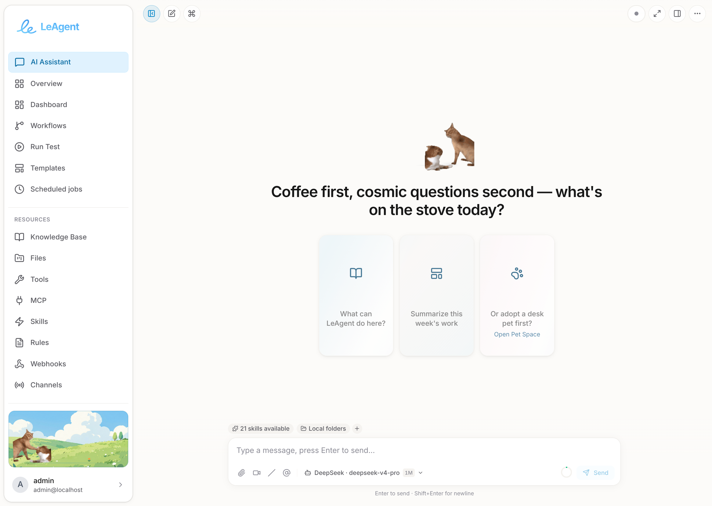

<p align="center">
  
</p>

<h1 align="center">LeAgent</h1>

<p align="center">
  <strong>The open-source desktop AI agent that gets work done — an agent that plans and self-corrects, agentic visual workflows, generative UI, and 100+ offline tools in a single self-hostable stack.</strong>
</p>

<p align="center">
  <a href="../../actions/workflows/ci.yml"></a>
  <a href="../../releases/latest"></a>
  
  
  
  <a href="LICENSE"></a>
  
</p>

<p align="center">
  <a href="README_zh.md">中文文档</a> ·
  <a href="README_lzh.md">汉文</a> ·
  <a href="./docs/tutorial.md">Tutorial</a> ·
  <a href="AGENTS.md">Contributor guide</a> ·
  <a href="https://github.com/vixues/LeAgent/releases">Releases</a>
</p>

<p align="center">
  
</p>

---

**LeAgent** is an open-source desktop AI agent that doesn't just chat — it gets work done. Unlike cloud chatbots and code-only CLIs, LeAgent fuses three capabilities most agents keep apart: a streaming agent runtime that **plans, calls tools, and self-corrects** in one think-act loop; **agentic visual workflows** where the agent designs, runs, and refines ReactFlow DAGs (and every one of its tools is automatically a typed node); and a **generative UI** layer that streams live, interactive interfaces — KPI boards, slide decks, galleries — right into the chat. It ships **100+ built-in offline tools** (documents, web, data, code, databases, media, game-art generation) plus a declarative rule engine, Agent Skills, and the Model Context Protocol — all running locally with **zero external dependencies by default** (SQLite, single process). Bring your own model keys, or run **fully offline** against a local Ollama / vLLM endpoint.

It is built for people who want a private, hackable, self-hosted alternative to closed agent products: your documents, sessions, and credentials never leave the machine unless you point a provider at a remote API.

## Highlights

- **Agent runtime** — multi-turn sessions with token streaming, tool execution, tiered model routing, layered prompt assembly, and a cognitive three-store memory (episodic / semantic / procedural). The `QueryEngine` session orchestrator drives both chat and background paths through one think-act loop, with durable checkpoints for pausing and resuming turns.
- **100+ offline tools** — documents, web research, data wrangling, code execution, databases, generative UI, charts, media, and coding projects (see the [tool catalog](#tool-catalog) below).
- **Visual workflows** — a ReactFlow editor with YAML export, reusable templates, and automatic typed nodes for every tool. The engine stages ready batches, runs independent branches concurrently, and applies centralized retry/backoff and timeouts.
- **Agent Skills** — [Agent Skills v1.0](https://agentskills.my/specification) `SKILL.md` bundles with progressive disclosure and on-demand loading. Ship built-in skills, install from links or archives, or plug in an HTTP skill registry.
- **Research Paper Mode** — open a PDF and the agent becomes a citation-grounded research analyst: structure & outline extraction, faithful section / whole-paper summaries, reference and LaTeX-formula extraction, and region translation — with reader tabs and matching agent tools, text extraction fully offline. ([guide](docs/research-paper-mode.md))
- **Generative UI** — agents stream declarative UI trees (KPI boards, slide decks, galleries, steppers) that render inline in chat and export to PDF or PPTX.
- **Game-art asset pipeline** — first-class, composable generation nodes (image / video / 3D mesh / VFX) with typed media sockets, a quality gate plus a bounded self-correction loop, and inline canvas previews. Runs end-to-end offline with no credentials. ([docs](backend/docs/workflow-engine/art-asset-nodes.md))
- **Multi-provider LLM** — DeepSeek, DashScope (Qwen), OpenAI, Anthropic, Azure OpenAI, Ollama, and vLLM, with cost-tiered routing and failover. DeepSeek is the most thoroughly validated and recommended for first use.
- **Sidebar desk pet** — a customizable avatar with walk/jump animations and personality bubbles, synced to chat streaming and session state. Upload PNG / SVG / GIF or sprite sheets.
- **Integrations** — MCP servers, inbound webhooks, scheduled cron jobs, outbound channels (IM/console), and a declarative YAML rule engine.
- **Zero-config default** — SQLite out of the box and a single Docker container. Scale out with PostgreSQL and Milvus (vector-backed memory) when you need to.

## What you can build

LeAgent is a complete agent platform, not a starter kit — the building blocks below are wired together and work out of the box, fully offline by default.

- **Office automation** — point it at a folder of invoices, contracts, or reports: it OCRs and classifies the files, extracts structured data into Excel, and produces a polished Word or PPTX summary in a single turn.
- **Research & briefings** — search across DuckDuckGo / SearXNG / Bing, scrape and download sources, then assemble a cited PDF report with charts and KPI dashboards.
- **Data analysis** — load CSV/Excel or query the database, clean, merge, aggregate, run SQL and vector search, and narrate the findings with generated charts.
- **Coding companion** — scaffold a project from a template, edit files across the tree, run a live dev server behind a preview proxy, and execute code in an isolated sandbox.
- **Game-art production** — turn a text brief into images, video, 3D meshes, and VFX sprite sheets through a node graph that self-corrects against a quality gate and exports an engine-ready (Unity / Unreal / Godot) bundle.
- **Live, interactive answers** — stream Generative UI (KPI boards, slide decks, galleries, steppers) straight into chat, then export it to PDF or PPTX.
- **Always-on automation** — schedule cron jobs, trigger flows from inbound webhooks, fan out to IM channels (DingTalk / Feishu / WeChat Work), and gate behaviour with declarative YAML rules.

## Architecture

LeAgent is an async Python (FastAPI) backend plus a React 19 single-page app, packaged as a modular monolith. The backend uses a strict, downward-only layered domain model — **File → Code → Project** — over a single persistence layer, and every agent turn (chat, SDK, background task, sub-agent, workflow node) converges on **one think-act kernel**.

```text
LeAgent/
├── backend/                 # FastAPI backend (Python 3.11+, uv-managed)
│   └── leagent/
│       ├── agent/           # QueryEngine orchestrator, planner, subagents
│       ├── sdk/             # Versioned public Agent SDK (runtime, kernel, protocols)
│       ├── api/             # FastAPI routers (v1 + incubating v2)
│       ├── llm/             # LLM service, providers, transport, streaming, generation
│       ├── tools/           # 100+ tools across 13 categories
│       ├── workflow/        # Workflow engine, nodes, art-asset pipeline, templates
│       ├── context/         # Source-driven, relevance-gated prompt assembly
│       ├── prompts/         # Layered PromptBuilder, registry, templates
│       ├── memory/          # Episodic / semantic / procedural agent memory
│       ├── skills/          # Agent Skills v1.0 loader + registry
│       ├── rules/           # Declarative YAML rule engine
│       ├── mcp/             # Model Context Protocol
│       ├── file/ code/ project/   # Layered file → code → project domain model
│       ├── db/              # Persistence: engine, SQLModel models, repositories
│       └── services/        # DB, auth, chat, session, gen-ui, cron, ...
├── frontend/                # React 19 + TypeScript SPA (Vite, Zustand, React Query)
├── desktop/                 # Electron shell (bundled Python runtime)
├── deploy/                  # Dockerfile + SQLite-only Compose
├── config/                  # Demo workflows + workflow templates
├── docs/                    # Architecture, guides, deployment docs
└── start.sh / start.ps1     # Dev orchestrator (uv + npm)
```

### Execution model

Regardless of where a request enters, it flows through one set of well-defined boundaries. Each ingress mints a single `ExecutionRun` (with a `run_id` and, for child scopes, a `parent_run_id`), goes through a thin facade, runs on the shared kernel, and persists to durable state with one owner per state class:

```text
Ingress   HTTP/SSE · WebSocket · Cron · Background task · GenUI
   │
   ▼
Facade    ServiceManager.runtime_context · AgentRuntime · WorkflowService
   │
   ▼
Kernel    run_loop → QueryEngine → tool executor          (single think-act loop)
   │
   ▼
State     TieredSessionStore · CheckpointStore · WorkflowStateStore
   │
   ▼
Observe   EventManager (FLOW_*/TASK_*/AGENT_*) · OpenTelemetry
```

- **One kernel.** Chat and every background path drive through `leagent.sdk.kernel.run_loop`. Turns pause to a durable checkpoint when they await user input, then resume exactly where they left off.
- **Three workflow shapes, one engine.** Saved DAG flows, chat playbook step-cards (compiled to linear flows), and in-chat graph embeds all execute on the same `WorkflowExecutor`, which stages ready batches, runs independent branches concurrently, and applies centralized retry/backoff and timeouts.
- **Clear state ownership.** The chat transcript lives in `TieredSessionStore`, paused turns in `CheckpointStore` (`agent_checkpoints`), and workflow runs in `WorkflowStateStore` — no shared mutable state across subsystems.

See [`AGENTS.md`](AGENTS.md) for the full subsystem map and [`docs/technical/execution-topology.md`](docs/technical/execution-topology.md) for the authoritative agent-loop / workflow-engine state contract.

## Tool catalog

Every tool is auto-exposed as a typed workflow node, so anything the agent can call can also be wired into a visual flow.

| Category | What it covers |
| --- | --- |
| **Documents** | Read/write Word, Excel, PPTX, PDF; OCR; classification; archives; text processing |
| **Web** | Search (DuckDuckGo / SearXNG / Bing), scraping, image & native media download |
| **Data** | Clean, merge, validate, transform, aggregate, SQL & vector search |
| **Code** | Sandboxed in-process scripts and a subprocess code-execution agent |
| **Database** | Schema-aware querying over the managed database |
| **Generate** | Word / Excel / PPTX / PDF / report / checklist / template-fill generators |
| **Canvas / GenUI** | Stream and patch declarative UI trees; publish canvases |
| **Charts & Images** | Chart generation and image processing |
| **Media** | Image / video / 3D / audio generation backends |
| **Skills** | Discover, install, and invoke Agent Skills |
| **Workflow** | Save, run, and inspect workflows from inside an agent turn |
| **Integration** | MCP, webhooks, channels, and external service calls |
| **Utilities** | Cron, tasks, rule matching, folders, text splitting, pet bubbles, and more |

## Capabilities in depth

### Agent runtime & memory

- Multi-turn streaming sessions with tiered model routing, automatic context compaction (micro + auto), and abort-safe tool execution.
- Hybrid reasoning — ReAct-style tool loops *plus* plan-and-execute — with sub-agent delegation and per-turn recovery.
- Cognitive three-store memory: episodic (past turns), semantic (extracted facts), and procedural (tool success rates), with hybrid semantic + lexical recall that degrades gracefully when no vector store is configured.
- Layered prompt assembly with relevance-gated policy/playbook sources, per-layer and global budgets, and provider-aware rendering (including Anthropic prompt-cache boundaries).

### Workflow engine

- One DAG executor backs saved flows, in-chat step cards, cron jobs, and agent-authored graphs.
- Concurrent branch execution by ready batches, centralized retry/backoff, per-node timeouts, and durable pause/resume.
- Every registered tool is lifted into a typed `Tool.<name>` node automatically — exposing a new capability visually needs zero glue code.

### Tools & code execution

- 100+ first-party tools across 13 categories, dispatched through one executor with a path sandbox and permission hooks.
- Two-tier code execution: a fast in-process RestrictedPython sandbox for workflow scripts, and a subprocess sandbox (rlimits, timeouts, per-session workspace) for heavier work.
- Files are first-class — tools return `FileRef`s through a unified file layer with HMAC-signed preview/download URLs.

### Skills, MCP & integrations

- Agent Skills v1.0 (`SKILL.md`) with progressive disclosure: ship built-ins, install from links/archives, or connect an HTTP skill registry.
- Model Context Protocol client for external tool servers; inbound webhooks; outbound IM/console channels; and a declarative YAML rule engine for guardrails and automation.

### Generative UI & media

- Declarative UI trees stream and patch live over SSE, render inline in chat, and export to PDF or PPTX.
- A first-class media plane (image / video / 3D / VFX / audio) behind a strategy-and-registry generation service with retry + failover, plus a deterministic offline floor that needs no credentials.

### Multi-model routing

Cost-tiered routing (`tier1` reasoning / `tier2` fast) with automatic failover — bring cloud keys, or stay fully local.

| Provider | Notes |
| --- | --- |
| **DeepSeek** | Recommended default; auto-aliased to `tier1` (v4-pro) + `tier2` (v4-flash); reasoning content + prompt-cache metrics |
| **DashScope (Qwen)** | Thinking + search modes |
| **OpenAI / Anthropic / Azure OpenAI** | Cloud frontier models |
| **Ollama / vLLM** | Fully local / self-hosted OpenAI-compatible inference |

## Quick Start

### Local dev (recommended for hackers)

**Prerequisites:** git, [uv](https://docs.astral.sh/uv/), Node.js 20+ or 22+

```bash
git clone https://github.com/vixues/LeAgent.git
cd LeAgent
./start.sh                # backend :7860 + frontend :5173
```

The dev orchestrator syncs the Python env with `uv`, installs frontend deps, and (unless skipped) installs the Playwright Chromium used by web tools.

### Docker

```bash
cd LeAgent/deploy
cp .env.example .env      # set LEAGENT_SECRET_KEY + at least one provider key
docker compose up -d --build
```

API and interactive docs at `http://localhost:8000/docs`. The default image is a single SQLite-backed container; optional overlays add a local GPU vLLM service (`docker-compose.vllm.yml`).

### Manual setup

```bash
# Backend
cd backend
uv sync --extra dev
uv run leagent init
uv run leagent app

# Frontend (separate terminal)
cd frontend
npm install && npm run dev
```

### One-line install

```bash
curl -fsSL https://vixues.com.cn/install.sh | bash
```

### Configuration

Set at least one provider key (env var or **Settings → Environment secrets** in the web UI, which writes `~/.leagent/.env`). The most common knobs:

| Variable | Purpose |
| --- | --- |
| `LEAGENT_SECRET_KEY` | App secret for signed URLs and session crypto (`openssl rand -hex 32`) |
| `DEEPSEEK_API_KEY` | DeepSeek provider — auto-aliased as `tier1` (reasoning) / `tier2` (fast) |
| `OPENAI_API_KEY` / `ANTHROPIC_API_KEY` / `DASHSCOPE_API_KEY` | Additional cloud providers |
| `VLLM_ENDPOINT` / `LLM_OLLAMA_ENDPOINT` | Local / self-hosted OpenAI-compatible inference |
| `DATABASE_URL` | Switch from SQLite to PostgreSQL |
| `LEAGENT_DEBUG` | Enable debug logging |

See [`deploy/.env.example`](deploy/.env.example) for the full annotated list.

## Desktop app (Beta — features still being refined)

Installers for each platform ship with every GitHub release — download and run. No separate Python, Node, or Docker install required; the build bundles its own Python runtime and backend.

| Platform | Download | Notes |
| --- | --- | --- |
| **Windows 10/11 (x64)** | [`LeAgent-Setup-*.exe`](../../releases/latest) | NSIS installer; desktop + start-menu shortcut |
| **macOS (Apple Silicon)** | [`LeAgent-*-arm64.dmg`](../../releases/latest) | Unsigned — `xattr -dr com.apple.quarantine /Applications/LeAgent.app` after install |
| **macOS (Intel)** | [`LeAgent-*.dmg`](../../releases/latest) | Same Gatekeeper note as above |
| **Linux (x64)** | [`LeAgent-*.AppImage`](../../releases/latest) / [`LeAgent-*.deb`](../../releases/latest) | AppImage: `chmod +x` then run. `.deb`: `sudo dpkg -i` |

See all releases: **<https://github.com/vixues/LeAgent/releases>**

## Tech stack

| Layer | Technology |
| --- | --- |
| **Backend** | Python 3.11+, FastAPI, Uvicorn/Gunicorn, SQLModel + Alembic, Pydantic v2, async I/O, OpenTelemetry |
| **Frontend** | React 19, TypeScript, Vite, Zustand, TanStack Query, ReactFlow, i18next (zh-CN / en-US / 汉文) |
| **Desktop** | Electron (ESM main process), bundled Python backend |
| **Data** | SQLite (default), PostgreSQL (optional), Milvus (optional vector memory) |
| **Tooling** | uv (Python), npm (frontend), Playwright, black + ruff, ESLint |

## Operations

- **Ports.** Local dev serves the backend on `:7860` and the Vite frontend on `:5173` (`start.sh`); the Docker image publishes the API on `:8000`.
- **Persistence & backup.** State lives under `LEAGENT_HOME`: the SQLite database (WAL mode) plus the working-uploads, knowledge, and coding-project trees. A complete backup is the database **and** that directory.
- **Scaling.** The default single-process / single-worker setup is correct for SQLite (single writer). To scale out, switch to PostgreSQL via `DATABASE_URL` and front the app with sticky sessions (the in-process execution registry and event bus are per-worker). Milvus is optional and only powers vector-backed memory recall.
- **Observability.** Structured JSON logs (structlog), OpenTelemetry spans when an OTLP endpoint is configured, and Prometheus workflow/quality histograms. Interactive API docs at `/docs`; set `LEAGENT_DEBUG=true` for verbose tracing.

## Documentation

The full documentation set lives in [`docs/`](docs/README.md) — start with the [architecture overview](docs/technical/architecture.md).

- **Start here** — [Architecture overview](docs/technical/architecture.md) · [Tutorial](docs/tutorial.md)
- **Runtime** — [Execution topology](docs/technical/execution-topology.md) · [Agent runtime](docs/technical/agent-runtime.md) · [Agent SDK](docs/technical/agent_sdk.md)
- **Capabilities** — [Research Paper Mode](docs/research-paper-mode.md) · [Workflow engine](backend/docs/workflow-engine/overview.md) · [Art-asset nodes](backend/docs/workflow-engine/art-asset-nodes.md) · [GenUI standard](docs/technical/genui-rendering-standard.md)
- **Tools & models** — [Tool parameter contract](docs/technical/tool-parameters.md) · [DeepSeek](docs/deepseek-guide.md) · [DashScope](docs/dashscope-guide.md) · [Custom models](docs/technical/custom-models.md)

## Contributing

Issues and pull requests are welcome. Please:

1. Open an issue for larger changes or ambiguous scope.
2. Run tests for touched areas (`cd backend && uv run pytest tests/ -v` / `cd frontend && npm run test`).
3. Follow [`AGENTS.md`](AGENTS.md) for coding conventions and i18n rules (every new UI string must exist in both `zh-CN` and `en-US` bundles).

See [`CONTRIBUTING.md`](CONTRIBUTING.md) for full guidelines and [`CODE_OF_CONDUCT.md`](CODE_OF_CONDUCT.md) for community standards.

## License

Apache License 2.0 — see [`LICENSE`](LICENSE).
