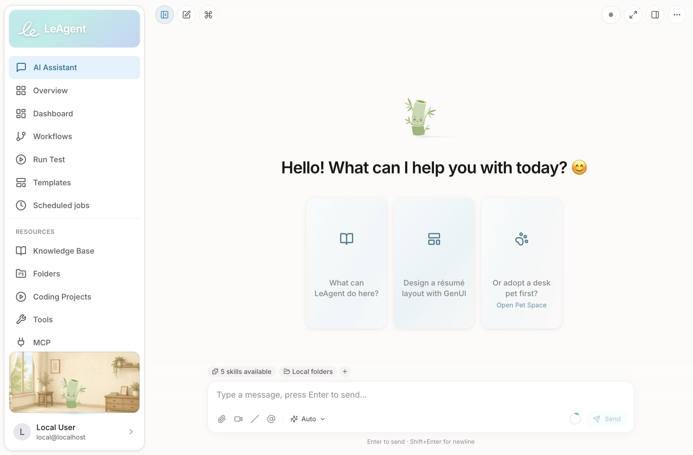

<p align="center">
  
</p>

<h1 align="center">LeAgent</h1>

<p align="center">
  <strong>Open-source desktop AI agent with conversational chat, visual workflows, 100+ tools, skills, MCP, and multi-model support.</strong>
</p>

<p align="center">
  <a href="../../actions/workflows/ci.yml"></a>
  <a href="../../releases/latest"></a>
  
  
  <a href="LICENSE"></a>
  
</p>

<p align="center">
  <a href="README_zh.md">中文文档</a>
</p>

<p align="center">
  
</p>

---

**LeAgent** is an open-source desktop AI agent that combines multi-turn chat, a visual workflow builder, 100+ built-in tools, a declarative rule engine, Agent Skills, and MCP — all in a single self-hostable stack.

- **Agent runtime** — multi-turn sessions with streaming, tool execution, tiered model routing, layered prompts, and episodic / semantic / procedural cognitive memory
- **Skills** — [Agent Skills v1.0](https://agentskills.my/specification) `SKILL.md` bundles with progressive disclosure and on-demand loading; built-in skills, install from links/archives, and a pluggable HTTP skill registry
- **100+ offline tools** — documents, web, data, code execution, databases, generative UI, coding projects, and more
- **Sidebar desk pet** — customizable avatar and background, walk/jump animations, and personality bubbles; upload PNG / SVG / GIF or sprite sheets, synced with chat streaming and session state
- **Visual workflows** — ReactFlow editor with YAML export, templates, and every tool as a typed node
- **Multi-provider LLM** — DeepSeek, DashScope (Qwen), OpenAI, Ollama, vLLM, and more (DeepSeek is currently the most thoroughly validated; recommended for first use)
- **Zero-config default** — SQLite out of the box, single Docker container, optional PostgreSQL / Milvus

---

## Quick Start

### Local dev (recommended for hackers)

**Prerequisites:** git, [uv](https://docs.astral.sh/uv/), Node.js 20+ or 22+

```bash
git clone https://github.com/vixues/LeAgent.git
cd LeAgent
./start.sh                # backend :7860 + frontend :5173
```

### Docker

```bash
cd LeAgent/deploy
cp .env.example .env      # set LEAGENT_SECRET_KEY + provider keys
docker compose up -d --build
```

API at `http://localhost:8000/docs`.

### Manual setup

```bash
# Backend
cd backend
uv sync --extra dev
uv run leagent init
uv run leagent app

# Frontend (separate terminal)
cd frontend
npm install && npm run dev
```

### One-line install

```bash
curl -fsSL https://vixues.com.cn/install.sh | bash
```

### Desktop app (Beta — features still being refined)

Installers for each platform ship with every GitHub release — download and run. No separate Python, Node, or Docker install required.

| Platform | Download | Notes |
| --- | --- | --- |
| **Windows 10/11 (x64)** | [`LeAgent-Setup-*.exe`](../../releases/latest) | NSIS installer; desktop + start-menu shortcut |
| **macOS (Apple Silicon)** | [`LeAgent-*-arm64.dmg`](../../releases/latest) | Unsigned — `xattr -dr com.apple.quarantine /Applications/LeAgent.app` after install |
| **macOS (Intel)** | [`LeAgent-*.dmg`](../../releases/latest) | Same Gatekeeper note as above |
| **Linux (x64)** | [`LeAgent-*.AppImage`](../../releases/latest) / [`LeAgent-*.deb`](../../releases/latest) | AppImage: `chmod +x` then run. `.deb`: `sudo dpkg -i` |

The desktop build bundles its own Python runtime and backend — ready to run after install.

See all releases: **<https://github.com/vixues/LeAgent/releases>**

---

## Contributing

Issues and pull requests are welcome. Please:

1. Open an issue for larger changes or ambiguous scope.
2. Run tests (`cd backend && uv run pytest tests/ -v` / `cd frontend && npm run test`) for touched areas.
3. Follow [`AGENTS.md`](AGENTS.md) for coding conventions and i18n rules.

See [`CONTRIBUTING.md`](CONTRIBUTING.md) for full guidelines.

---

## License

Apache License 2.0 — see [`LICENSE`](LICENSE).
