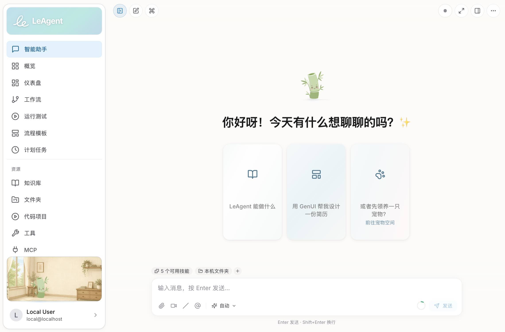

<p align="center">
  
</p>

<h1 align="center">LeAgent</h1>

<p align="center">
  <strong>真正完成工作的开源桌面 AI 智能体 —— 在可私有化部署技术栈中集成会自主规划与纠错的 Agent、智能化可视工作流、Generative UI 与百余项离线工具。</strong>
</p>

<p align="center">
  <a href="../../actions/workflows/ci.yml"></a>
  <a href="../../releases/latest"></a>
  
  
  
  <a href="LICENSE"></a>
  
</p>

<p align="center">
  <a href="README.md">English</a> ·
  <a href="README_lzh.md">雅言</a> ·
  <a href="docs/tutorial_zh.md">使用教程</a> ·
  <a href="AGENTS.md">贡献者指南</a> ·
  <a href="https://github.com/vixues/LeAgent/releases">版本发布</a>
</p>

<p align="center">
  
</p>

---

**LeAgent** 是一款开源桌面 AI 智能体——它不止于对话，更能真正完成工作。区别于云端聊天机器人和纯代码 CLI，LeAgent 将多数智能体彼此割裂的三项能力融为一体：在统一「思考-行动」循环中**自主规划、调用工具并自我纠错**的流式 Agent 运行时；由智能体**亲自设计、运行并迭代优化** ReactFlow DAG 的**智能化可视工作流**（且每一个工具都会自动成为带类型的节点）；以及把 KPI 看板、幻灯片、画廊等**实时可交互界面直接流式渲染进聊天**的 Generative UI 能力。它内置 **100+ 离线工具**（文档、网页、数据、代码、数据库、媒体、游戏美术生成），并集成声明式规则引擎、Agent Skills 与 Model Context Protocol——**默认零外部依赖**（SQLite、单进程）即可在本地运行。你可以自带模型密钥，也可以接入本地 Ollama / vLLM 端点**完全离线运行**。

它为追求私密、可二次开发、可自部署的用户而生：除非你主动将某个供应商指向远程 API，否则你的文档、会话与凭据都不会离开本机。

## 核心特性

- **Agent 运行时** —— 多轮会话、Token 流式输出、工具调用、分层模型路由、分层提示词组装，以及情景 / 语义 / 程序性三存储认知记忆。`QueryEngine` 会话编排器以统一的「思考-行动」循环驱动聊天与后台路径，并通过持久化检查点支持暂停与恢复回合。
- **100+ 离线工具** —— 文档、网页研究、数据处理、代码执行、数据库、Generative UI、图表、媒体与编码项目（详见下方[工具目录](#工具目录)）。
- **可视化工作流** —— 基于 ReactFlow 的编辑器，支持 YAML 导出、可复用模板，并为每个工具自动生成带类型的节点。引擎按就绪批次调度、并发执行独立分支，并统一应用重试/退避与超时。
- **Agent Skills** —— 符合 [Agent Skills v1.0](https://agentskills.my/specification) 的 `SKILL.md` 技能包，支持渐进式披露与按需加载。可使用内置技能、从链接或压缩包安装，或接入 HTTP 技能注册表。
- **论文模式** —— 打开 PDF，智能体即化身为以引用为依据的研究分析师：结构与大纲提取、忠实的章节 / 全文摘要、参考文献与 LaTeX 公式抽取、区域翻译 —— 配有阅读器标签页与对应的智能体工具，文本抽取完全离线。（[指南](docs/research-paper-mode.md)）
- **Generative UI** —— 智能体可流式输出声明式 UI 树（KPI 看板、幻灯片、画廊、步骤条），在聊天中内联渲染，并可导出为 PDF 或 PPTX。
- **游戏美术资产流水线** —— 一等公民、可组合的生成节点（图像 / 视频 / 3D 网格 / VFX），配备带类型的媒体插槽、质量门控与有界自纠错循环，以及画布内联预览；无需任何凭据即可端到端离线运行。（[文档](backend/docs/workflow-engine/art-asset-nodes.md)）
- **多 LLM 供应商** —— 支持 DeepSeek、通义千问（DashScope）、OpenAI、Anthropic、Azure OpenAI、Ollama 与 vLLM，具备按成本分层的路由与故障转移。当前以 DeepSeek 完成最充分验证，推荐优先使用。
- **侧栏桌宠** —— 可定制形象，带行走/跳跃动画与人格气泡，并随聊天流式输出与会话状态联动；支持上传 PNG / SVG / GIF 或精灵图。
- **集成能力** —— MCP 服务、入站 Webhook、定时 Cron 任务、出站渠道（IM/控制台），以及声明式 YAML 规则引擎。
- **零配置起步** —— 默认 SQLite、单容器 Docker 即可运行；按需接入 PostgreSQL 与 Milvus（向量记忆）实现横向扩展。

## 你能用它做什么

LeAgent 是一个完整的智能体平台，而非脚手架 —— 下列能力开箱即用、相互打通，默认即可完全离线运行。

- **办公自动化** —— 指向一个装满发票、合同或报告的文件夹：它会完成 OCR 与分类、把结构化数据抽取进 Excel，并在一次回合内产出排版精良的 Word 或 PPTX 摘要。
- **研究与简报** —— 跨 DuckDuckGo / SearXNG / Bing 搜索，抓取并下载来源，再汇编成带图表与 KPI 看板、附引用的 PDF 报告。
- **数据分析** —— 加载 CSV/Excel 或查询数据库，进行清洗、合并、聚合、SQL 与向量检索，并以生成的图表叙述结论。
- **编码助手** —— 从模板脚手架创建项目、跨目录树编辑文件、在预览代理后运行实时开发服务器，并在隔离沙箱中执行代码。
- **游戏美术生产** —— 将文字简报转化为图像、视频、3D 网格与 VFX 精灵图：节点图会针对质量门控自我纠错，并导出可直接接入引擎（Unity / Unreal / Godot）的资产包。
- **实时可交互回答** —— 将 Generative UI（KPI 看板、幻灯片、画廊、步骤条）直接流式输出到聊天中，并可导出为 PDF 或 PPTX。
- **常驻自动化** —— 调度 Cron 任务、由入站 Webhook 触发流程、扇出到 IM 渠道（钉钉 / 飞书 / 企业微信），并以声明式 YAML 规则约束行为。

## 架构

LeAgent 由异步 Python（FastAPI）后端与 React 19 单页应用组成，以模块化单体（modular monolith）形式打包。后端采用严格的、仅向下依赖的分层领域模型 —— **File → Code → Project**，构建于统一的持久化层之上；并且无论请求从何处进入（聊天、SDK、后台任务、子智能体、工作流节点），每一次智能体回合都汇聚到**同一个「思考-行动」内核**。

```text
LeAgent/
├── backend/                 # FastAPI 后端（Python 3.11+，uv 管理）
│   └── leagent/
│       ├── agent/           # QueryEngine 编排器、规划器、子智能体
│       ├── sdk/             # 版本化的公共 Agent SDK（运行时、内核、协议）
│       ├── api/             # FastAPI 路由（v1 + 孵化中的 v2）
│       ├── llm/             # LLM 服务、供应商、传输、流式、生成
│       ├── tools/           # 13 个类别下的 100+ 工具
│       ├── workflow/        # 工作流引擎、节点、美术资产流水线、模板
│       ├── context/         # 源驱动、按相关性门控的提示词组装
│       ├── prompts/         # 分层 PromptBuilder、注册表、模板
│       ├── memory/          # 情景 / 语义 / 程序性 Agent 记忆
│       ├── skills/          # Agent Skills v1.0 加载器与注册表
│       ├── rules/           # 声明式 YAML 规则引擎
│       ├── mcp/             # Model Context Protocol
│       ├── file/ code/ project/   # 分层 file → code → project 领域模型
│       ├── db/              # 持久化：引擎、SQLModel 模型、仓储
│       └── services/        # DB、鉴权、聊天、会话、gen-ui、cron 等
├── frontend/                # React 19 + TypeScript SPA（Vite、Zustand、React Query）
├── desktop/                 # Electron 外壳（内置 Python 运行时）
├── deploy/                  # Dockerfile + 仅 SQLite 的 Compose
├── config/                  # 演示工作流 + 工作流模板
├── docs/                    # 架构、指南、部署文档
└── start.sh / start.ps1     # 开发编排器（uv + npm）
```

### 执行模型

无论请求从何处进入，都会经过一组清晰界定的边界。每个入口都会铸造唯一的 `ExecutionRun`（带 `run_id`，子作用域附带 `parent_run_id`），经由轻量门面进入共享内核运行，并落入「每类状态唯一归属」的持久化层：

```text
入口     HTTP/SSE · WebSocket · Cron · 后台任务 · GenUI
   │
   ▼
门面     ServiceManager.runtime_context · AgentRuntime · WorkflowService
   │
   ▼
内核     run_loop → QueryEngine → 工具执行器           （单一思考-行动循环）
   │
   ▼
状态     TieredSessionStore · CheckpointStore · WorkflowStateStore
   │
   ▼
观测     EventManager（FLOW_*/TASK_*/AGENT_*）· OpenTelemetry
```

- **单一内核。** 聊天与所有后台路径都经由 `leagent.sdk.kernel.run_loop`。当回合需要等待用户输入时会暂停到持久化检查点，之后从中断处精确恢复。
- **三种工作流形态，同一引擎。** 已保存的 DAG 流程、聊天 Playbook 步骤卡（编译为线性流程）、以及聊天内的图嵌入，都在同一个 `WorkflowExecutor` 上执行：按就绪批次调度、并发执行独立分支，并统一应用重试/退避与超时。
- **清晰的状态归属。** 聊天记录存于 `TieredSessionStore`，暂停的回合存于 `CheckpointStore`（`agent_checkpoints`），工作流运行存于 `WorkflowStateStore` —— 子系统之间不共享可变状态。

完整的子系统地图见 [`AGENTS.md`](AGENTS.md)；Agent 循环 / 工作流引擎的权威状态契约见 [`docs/technical/execution-topology_zh.md`](docs/technical/execution-topology_zh.md)。

## 工具目录

每个工具都会自动暴露为带类型的工作流节点，因此智能体能调用的任何能力，都能编排进可视化流程。

| 类别 | 涵盖内容 |
| --- | --- |
| **文档** | 读写 Word、Excel、PPTX、PDF；OCR；分类；压缩包；文本处理 |
| **网页** | 搜索（DuckDuckGo / SearXNG / Bing）、抓取、图片与原生媒体下载 |
| **数据** | 清洗、合并、校验、转换、聚合、SQL 与向量检索 |
| **代码** | 沙箱内进程脚本，以及子进程代码执行智能体 |
| **数据库** | 面向托管数据库的 Schema 感知查询 |
| **生成** | Word / Excel / PPTX / PDF / 报告 / 清单 / 模板填充 生成器 |
| **Canvas / GenUI** | 流式输出与增量更新声明式 UI 树；发布画布 |
| **图表与图像** | 图表生成与图像处理 |
| **媒体** | 图像 / 视频 / 3D / 音频 生成后端 |
| **技能** | 发现、安装与调用 Agent Skills |
| **工作流** | 在一次智能体回合内保存、运行与检查工作流 |
| **集成** | MCP、Webhook、渠道与外部服务调用 |
| **实用工具** | Cron、任务、规则匹配、文件夹、文本切分、桌宠气泡等 |

## 深入能力

### Agent 运行时与记忆

- 多轮流式会话，支持分层模型路由、自动上下文压缩（micro + auto），以及可安全中止的工具执行。
- 混合推理 —— ReAct 式工具循环 **与** plan-and-execute 并存，支持子智能体委派与单回合恢复。
- 情景 / 语义 / 程序性三存储认知记忆（过往回合 / 抽取事实 / 工具成功率），具备语义 + 词法混合召回；未配置向量库时可优雅降级。
- 分层提示词组装：按相关性门控的策略 / Playbook 源、逐层与全局预算，以及供应商感知渲染（含 Anthropic 提示缓存边界）。

### 工作流引擎

- 单一 DAG 执行器同时支撑已保存流程、聊天步骤卡、Cron 任务与智能体编写的图。
- 按就绪批次并发执行独立分支，统一重试/退避、逐节点超时，以及可持久化的暂停/恢复。
- 每个已注册工具都会被自动提升为带类型的 `Tool.<name>` 节点 —— 让新能力以可视化方式可用，无需任何胶水代码。

### 工具与代码执行

- 13 个类别下的 100+ 一等工具，统一经由单一执行器分发，配备路径沙箱与权限钩子。
- 两级代码执行：面向工作流脚本的快速 in-process RestrictedPython 沙箱，以及面向重型任务的子进程沙箱（rlimit、超时、按会话工作区）。
- 文件是一等公民 —— 工具通过统一文件层返回 `FileRef`，并提供 HMAC 签名的预览/下载 URL。

### 技能、MCP 与集成

- Agent Skills v1.0（`SKILL.md`），支持渐进式披露：可使用内置技能、从链接/压缩包安装，或接入 HTTP 技能注册表。
- Model Context Protocol 客户端可对接外部工具服务器；入站 Webhook；出站 IM/控制台渠道；以及用于护栏与自动化的声明式 YAML 规则引擎。

### Generative UI 与媒体

- 声明式 UI 树通过 SSE 实时流式输出与增量更新，在聊天中内联渲染，并可导出为 PDF 或 PPTX。
- 一等的媒体平面（图像 / 视频 / 3D / VFX / 音频），由「策略 + 注册表」式生成服务驱动，具备重试 + 故障转移，并提供无需任何凭据的确定性离线兜底。

### 多模型路由

按成本分层路由（`tier1` 推理 / `tier2` 快速），并在供应商间自动故障转移 —— 既可自带云端密钥，也可完全本地运行。

| 供应商 | 说明 |
| --- | --- |
| **DeepSeek** | 推荐默认；自动别名为 `tier1`（v4-pro）+ `tier2`（v4-flash）；含 reasoning 内容与提示缓存指标 |
| **通义千问（DashScope）** | 支持思考与搜索模式 |
| **OpenAI / Anthropic / Azure OpenAI** | 云端前沿模型 |
| **Ollama / vLLM** | 完全本地 / 自托管的 OpenAI 兼容推理 |

## 快速开始

### 本地开发（适合二次开发）

**环境要求：** git、[uv](https://docs.astral.sh/uv/)、Node.js 20+ 或 22+

```bash
git clone https://github.com/vixues/LeAgent.git
cd LeAgent
./start.sh                # 后端 :7860 + 前端 :5173
```

开发编排器会用 `uv` 同步 Python 环境、安装前端依赖，并（除非显式跳过）安装网页工具所需的 Playwright Chromium。

### Docker

```bash
cd LeAgent/deploy
cp .env.example .env      # 配置 LEAGENT_SECRET_KEY 与至少一个供应商密钥
docker compose up -d --build
```

API 与交互式文档：`http://localhost:8000/docs`。默认镜像为单一 SQLite 容器；可选叠加层可添加本地 GPU vLLM 服务（`docker-compose.vllm.yml`）。

### 手动安装

```bash
# 后端
cd backend
uv sync --extra dev
uv run leagent init
uv run leagent app

# 前端（另开终端）
cd frontend
npm install && npm run dev
```

### 一键安装

```bash
curl -fsSL https://vixues.com.cn/install.sh | bash
```

### 配置

至少配置一个供应商密钥（通过环境变量，或在 Web UI 的 **设置 → 环境密钥** 中填写，后者会写入 `~/.leagent/.env`）。最常用的配置项：

| 变量 | 作用 |
| --- | --- |
| `LEAGENT_SECRET_KEY` | 用于签名 URL 与会话加密的应用密钥（`openssl rand -hex 32`） |
| `DEEPSEEK_API_KEY` | DeepSeek 供应商 —— 自动别名为 `tier1`（推理）/ `tier2`（快速） |
| `OPENAI_API_KEY` / `ANTHROPIC_API_KEY` / `DASHSCOPE_API_KEY` | 其他云端供应商 |
| `VLLM_ENDPOINT` / `LLM_OLLAMA_ENDPOINT` | 本地 / 自托管的 OpenAI 兼容推理端点 |
| `DATABASE_URL` | 从 SQLite 切换到 PostgreSQL |
| `LEAGENT_DEBUG` | 开启调试日志 |

完整的带注释清单见 [`deploy/.env.example`](deploy/.env.example)。

## 桌面客户端（测试版，功能仍在完善）

各平台安装包随 GitHub Release 发布，下载即可使用，无需单独安装 Python、Node 或 Docker；安装包内置 Python 运行时与后端。

| 平台 | 下载 | 说明 |
| --- | --- | --- |
| **Windows 10/11（x64）** | [`LeAgent-Setup-*.exe`](../../releases/latest) | NSIS 安装包，自动创建桌面与开始菜单快捷方式 |
| **macOS（Apple 芯片）** | [`LeAgent-*-arm64.dmg`](../../releases/latest) | 未签名 —— 安装后执行 `xattr -dr com.apple.quarantine /Applications/LeAgent.app` |
| **macOS（Intel）** | [`LeAgent-*.dmg`](../../releases/latest) | 同上，需处理 Gatekeeper 提示 |
| **Linux（x64）** | [`LeAgent-*.AppImage`](../../releases/latest) / [`LeAgent-*.deb`](../../releases/latest) | AppImage：`chmod +x` 后运行；`.deb`：`sudo dpkg -i` |

全部历史版本：**<https://github.com/vixues/LeAgent/releases>**

## 技术栈

| 层级 | 技术 |
| --- | --- |
| **后端** | Python 3.11+、FastAPI、Uvicorn/Gunicorn、SQLModel + Alembic、Pydantic v2、异步 I/O、OpenTelemetry |
| **前端** | React 19、TypeScript、Vite、Zustand、TanStack Query、ReactFlow、i18next（zh-CN / en-US / [雅言](docs/lzh-style-guide.md)） |
| **桌面端** | Electron（ESM 主进程）、内置 Python 后端 |
| **数据** | SQLite（默认）、PostgreSQL（可选）、Milvus（可选向量记忆） |
| **工具链** | uv（Python）、npm（前端）、Playwright、black + ruff、ESLint |

## 运维

- **端口。** 本地开发后端监听 `:7860`、Vite 前端监听 `:5173`（`start.sh`）；Docker 镜像将 API 发布在 `:8000`。
- **持久化与备份。** 状态均位于 `LEAGENT_HOME` 下：SQLite 数据库（WAL 模式），以及上传工作目录、知识库与编码项目目录树。完整备份 = 数据库 **加上** 该目录。
- **横向扩展。** 默认单进程 / 单 worker 适配 SQLite（单写入者）。如需扩展，请通过 `DATABASE_URL` 切换到 PostgreSQL，并在前端使用粘性会话（in-process 的执行注册表与事件总线按 worker 隔离）。Milvus 为可选项，仅用于向量记忆召回。
- **可观测性。** 结构化 JSON 日志（structlog）、配置 OTLP 端点后输出 OpenTelemetry Span，以及 Prometheus 工作流/质量直方图。交互式 API 文档位于 `/docs`；设置 `LEAGENT_DEBUG=true` 可开启详细追踪。

## 文档

完整文档位于 [`docs/`](docs/README.md) —— 建议从[架构总览](docs/technical/architecture.md)开始。

- **从这里开始** —— [架构总览](docs/technical/architecture.md) · [使用教程](docs/tutorial_zh.md)
- **运行时** —— [执行拓扑](docs/technical/execution-topology_zh.md) · [Agent 运行时](docs/technical/agent-runtime_zh.md) · [Agent SDK](docs/technical/agent_sdk_zh.md)
- **能力** —— [论文模式](docs/research-paper-mode.md) · [工作流引擎](backend/docs/workflow-engine/overview.md) · [美术资产节点](backend/docs/workflow-engine/art-asset-nodes.md) · [GenUI 标准](docs/technical/genui-rendering-standard.md)
- **工具与模型** —— [工具参数约定](docs/technical/tool-parameters_zh.md) · [DeepSeek](docs/deepseek-guide_zh.md) · [DashScope](docs/dashscope-guide_zh.md) · [自定义模型](docs/technical/custom-models_zh.md)

## 参与贡献

欢迎提交 Issue 与 Pull Request：

1. 较大改动或范围不明确的修改，请先开 Issue 讨论。
2. 请为涉及改动的部分运行测试（`cd backend && uv run pytest tests/ -v` / `cd frontend && npm run test`）。
3. 遵循 [`AGENTS.md`](AGENTS.md) 中的代码规范与 i18n 规则（每个新增 UI 文案都必须同时出现在 `zh-CN` 与 `en-US` 词条文件中）。

更多说明见 [`CONTRIBUTING.md`](CONTRIBUTING.md)，社区准则见 [`CODE_OF_CONDUCT.md`](CODE_OF_CONDUCT.md)。

## 许可证

Apache License 2.0 —— 详见 [`LICENSE`](LICENSE)。
