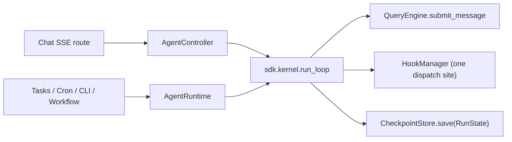

# LeAgent Agent Runtime SDK

> Status: production. Package: `backend/leagent/runtime/`.

The Agent Runtime is the unified, SDK-governed harness for building and
executing agents in LeAgent. It replaces the previous pattern of
hand-constructing `QueryEngine` / `QueryEngineConfig` at every call site
(chat API, background tasks, cron, CLI, workflow nodes, sub-agents) with a
single declarative contract plus one execution facade.

The design goal: **define a domain agent once, run it everywhere** — with a
declarative source of truth (`AgentDefinition`) and a code-first fluent
builder (`AgentBuilder`), both resolved and executed through the same
`AgentRuntime`.

---

## 1. The three contracts

| Contract | File | Responsibility |
|---|---|---|
| `AgentDefinition` | `runtime/definition.py` | **What** an agent is: persona/prompt variant, tool policy, model policy, memory policy, runtime budget, composition (hooks/subagents). Pure data — no DI. |
| `RuntimeContext` | `runtime/context.py` | **How to reach services**: LLM, tool registry, tool executor, agent memory, session manager, hooks, skills, prompt builder, context settings. One injectable bundle. |
| `AgentRuntime` | `runtime/runtime.py` | **Execution facade**: resolves a definition, materialises a `QueryEngineConfig` from definition + context + per-call args, drives the `QueryEngine` loop, and yields a unified `AgentEvent` stream / `AgentResult`. |

```
AgentDefinition  +  RuntimeContext  +  per-call args
                         │
                         ▼
                  AgentRuntime._materialize_config()
                         │
                         ▼
                  QueryEngineConfig ──► QueryEngine ──► AgentEvent stream
```

### AgentDefinition

```python
from leagent.runtime import AgentDefinition, ToolPolicy, ModelPolicy, MemoryPolicy

AgentDefinition(
    name="support_agent",
    prompt_variant="default_agent",     # persona template
    context_recipe=None,                 # context-source recipe (defaults to prompt_variant)
    tools=ToolPolicy(allow=["web_search", "knowledge_*"], deny=[], max_tools=12),
    model=ModelPolicy(task="chat", temperature=0.1, max_output_tokens=8192),
    memory=MemoryPolicy(enabled=True, recall_limit=6, formation=True),
    runtime_profile="standard",
    max_turns=12,
    subagents=["script_agent"],
)
```

Key behaviours:

- `resolved_recipe()` returns `context_recipe or prompt_variant`, decoupling
  the **context assembly recipe** from the **persona variant**.
- `with_overrides(**fields)` returns a non-mutating shallow copy — used for
  per-turn and per-call overrides.

### AgentBuilder (code-first)

```python
from leagent.runtime import AgentBuilder

support = (
    AgentBuilder("support_agent")
    .describe("Customer support specialist")
    .variant("default_agent")
    .tools(allow=["web_search", "knowledge_*"], max_tools=12)
    .model(task="chat", temperature=0.3)
    .memory(recall_limit=8)
    .runtime(profile="standard", max_turns=12)
    .subagents("script_agent")
    .build()
)
```

`AgentBuilder.from_definition(existing)` seeds a builder for incremental
overrides. `build()` returns a validated, deep-copied `AgentDefinition`.

### AgentRegistry

`runtime/registry.py` is the lookup surface. The process-wide registry
(`get_agent_registry()`) lazily registers the built-ins:

| Agent | Variant | Notes |
|---|---|---|
| `default_agent` | `default_agent` | General office assistant; memory on; delegates to coding/script/subagent. |
| `coding_agent` | `coding_agent` | Project-scale engineering sub-agent; `coding_long` profile; formation off. |
| `script_agent` | `script_agent` | Sandboxed Python compute sub-agent; memory off. |
| `subagent` | `subagent` | General delegation sub-agent; memory off. |

Register a domain agent:

```python
runtime.registry.register(support)            # or get_agent_registry().register(support)
```

---

## 2. Execution

```python
from leagent.runtime import AgentRuntime

runtime = AgentRuntime.from_service_manager(service_manager)

# Aggregate result
result = await runtime.run("default_agent", "Summarise this PDF", session_id=sid)
print(result.text, result.success, result.tool_calls)

# Streaming
async for event in runtime.stream("coding_agent", "Refactor module X", cwd="/repo"):
    ...   # event.type / event.data — identical wire shape to SDKMessage
```

`AgentRuntime` accepts an `AgentRef` anywhere an agent is named: a registry
**name** (`str`), an `AgentDefinition`, or an `AgentBuilder`. Unknown names
fall back to a default-variant definition so the runtime never hard-fails.

### Materialisation

`_materialize_config()` maps the declarative policy onto `QueryEngineConfig`:

- **Tools** — a non-empty `tools.allow` builds a scoped child `ToolRegistry`
  and a matching `ToolExecutor`; `tools.deny` maps onto
  `tools_deny_patterns`; `tools.max_tools` onto `tools_max_tools`.
- **Model** — `model.task` selects the logical `ModelTask` binding;
  `provider`/`model` override it; `temperature`/`max_output_tokens` pass through.
- **Memory** — `memory.enabled=False` detaches `AgentMemory` (no recall);
  formation gating is applied by the controller for memory writes.
- **Context** — `resolved_recipe()` drives the `ContextManager` recipe,
  independent of `prompt_variant`.
- **Budget** — `runtime_profile` resolves a `RuntimeBudget`; explicit
  `max_turns` / `max_tool_calls_per_turn` override it.

### Unified events

`AgentEvent` (`runtime/events.py`) preserves the **exact `{type, data}` wire
shape** of the legacy `SDKMessage`, so existing SSE/WebSocket serializers
keep working unchanged:

```python
AgentEvent.from_sdk_message(msg)   # ingest
event.to_sdk_message()             # round-trip
event.is_terminal                  # type == "result"
```

`AgentResult` is the aggregate of a completed run (`text`, `reason`,
`error`, `usage`, `tool_calls`, `produced_files`, optional `events`).

### Single think-act path (`sdk.kernel.run_loop`)

Every execution path — **including the chat SSE route** — drives through the
one kernel loop, `leagent.sdk.kernel.loop.run_loop`. `AgentRuntime.stream`
and `AgentController._run_via_query_engine` both delegate to it rather than
iterating `QueryEngine.submit_message` directly. The loop:

- translates each `SDKMessage` into the wire-identical `AgentEvent`
  (`{type, data}`), so the SSE/WebSocket serializers are unchanged;
- snapshots `engine.mutable_messages` into `RunState.messages` so a
  checkpoint carries the real transcript;
- dispatches the **single-site** tool hook lifecycle
  (`TOOL_USE → dispatch_tool_call`, `TOOL_RESULT → dispatch_tool_result`,
  `RESULT → dispatch_complete`/`dispatch_error`) — call sites no longer fire
  tool hooks themselves, avoiding double-dispatch;
- forwards `**submit_kwargs` (e.g. `append_user_turn`) to the engine.



---

## 3. Sub-agent delegation

`AgentRuntime.delegate(parent, agent, prompt, **overrides)` is the unified
entry point for sub-agent invocation. It resolves the child
`AgentDefinition` for tool/model/budget policy, then drives the proven fork
core (`leagent.agent.subagent._run_subagent_core`) off the `parent`
(`AgentController` or `QueryEngine`). The fork mechanics — child-scoped
executor, abort bridge, nested-preview plumbing, file-state merge — are
reused, so delegation is declarative without re-implementing the
battle-tested core.

`CodingAgentTool`, `ScriptAgentTool`, and the generic `AgentTool` all route
through `get_delegation_runtime().delegate()`. `fork_subagent` remains as the
low-level primitive.

**Definition fidelity.** The child runs under *its own* policy, not the
parent's: `delegate` threads the resolved `context_recipe`,
`model.task/provider/model`, `memory` (enabled / `recall_limit` / formation),
and `tools.max_tools` from the child `AgentDefinition` into
`_run_subagent_core` and onto the forked engine config. A child with
`memory.enabled=False` is detached from `AgentMemory` so it performs no
recall. `subagent_start` / `subagent_stop` hooks fire around the delegated
run.

### Durable sessions & resume

When the kernel pauses a turn for `awaiting_user_input` (and optionally on a
terminal `completed`), it saves the `RunState` to the configured
`CheckpointStore` and stamps the `checkpoint_id` onto the `result` event.
This is the Codex `RolloutRecorder` / Claude `SessionStore` analogue.

- `CheckpointStore` (protocol in `sdk/protocols.py`) has two built-ins in
  `sdk/kernel/checkpoint.py`: `InMemoryCheckpointStore` (default/tests) and
  the durable `SQLCheckpointStore` (table `agent_checkpoints`, repository
  `db/repositories/agent_checkpoint.py`). `RuntimeContext.from_service_manager`
  injects the SQL store whenever a `DatabaseService` is present, so resume
  survives process restarts and works across workers.
- `AgentRuntime.resume(agent, checkpoint_id, prompt, **kw)` loads the
  checkpoint, rebuilds the engine seeded with `checkpoint.messages`
  (`build_engine(initial_messages=...)`), and streams a fresh turn driven by
  `prompt` (e.g. the user's answer to the pause). `AgentSession.resume(...)`
  is the convenience wrapper.
- The chat `awaiting_user_input` result surfaces `checkpoint_id` so the
  client can resume the durable run rather than relying solely on the legacy
  `resumable_state` blob.

---

## 4. Workflow integration

Agents are first-class workflow nodes via `agent_node_factory.py`, mirroring
the `Tool.<name>` pattern of `tool_factory.py`:

- Every registered `AgentDefinition` is lifted into an `Agent.<name>` node
  (category `agents`) at bootstrap (`nodes/loader.bootstrap`).
- Inputs: `prompt` (+ optional `max_turns`, `allowed_tools`, `project_path`,
  `read_only`, `output`). Outputs: `text`, `success`, `steps_count`.
- The runtime is injected through the workflow DI chain:
  `WorkflowExecutor(agent_runtime=...)` → `HiddenHolder.agent_runtime`
  (`Hidden.AGENT_RUNTIME`) → node `execute`.
- At execute time a node prefers `runtime.delegate(parent, …)` when a parent
  `agent_controller` is on the tool context, else runs standalone via
  `runtime.run(...)`.

The legacy `ScriptAgentNode` / `CodingAgentNode` keep their stable node IDs
and schemas but now delegate through `hidden.agent_runtime` instead of
bespoke agent construction.

`WorkflowExecutor` instances are wired with
`AgentRuntime.from_service_manager(sm, executor=tool_executor)` in
`service_manager.py` and the workflow worker; sub-workflows propagate the
runtime through `_ContextShim`.

---

## 5. Call-site migration (clean break)

| Call site | Path |
|---|---|
| Chat API | `chat_deps.build_agent_controller` → `AgentController` (a thin `AgentRuntime` wrapper). |
| Background agent tasks | `tasks/handlers/agent_handler.AgentTaskHandler` → `AgentRuntime.build_engine(...)`. |
| Cron | routes through `AgentTaskHandler` (`TaskType.AGENT`). |
| CLI | `cli/bootstrap.CLIServices.build_agent` → `AgentController`. |
| Workflow nodes | `Agent.<name>` nodes + `hidden.agent_runtime`. |
| Sub-agents | `AgentRuntime.delegate`. |

Removed in the clean break: `agent/executor.py` re-export shim,
`llm/router.py` shim, and the legacy registry-only `PromptBuilder` fallback
(`PromptBuilder.build` now requires a `ContextManager`, the single canonical
assembly path; `RuntimeContext` injects the builder explicitly).

---

## 6. Observability

`AgentRuntime` emits OpenTelemetry spans via `leagent.telemetry.otel`:

- `agent.runtime.stream` — attributes: `agent.name`, `agent.variant`,
  `agent.runtime_profile`, `agent.session_id`.
- `agent.runtime.delegate` — attributes: `agent.name`, `agent.variant`,
  `agent.max_turns`, `agent.parent`.

These nest under the existing `agent.query_turn` span emitted by
`QueryEngine`.

---

## 7. Tests

| Area | File |
|---|---|
| Definition / builder / registry / event wire parity; delegate fidelity | `backend/tests/test_runtime_sdk.py` |
| Workflow `Agent.<name>` factory (schema, registration, delegation) | `backend/tests/workflow/test_agent_nodes.py` |
| Kernel `run_loop` wire shape / messages / hooks; `SQLCheckpointStore` round-trip; resume | `backend/tests/test_kernel_checkpoint.py` |
| Chat SSE wire-contract regression (kernel reroute) | `backend/tests/test_chat_sse_wire_contract.py` |
| Plugin discovery (`leagent.llm_providers` / `leagent.context_sources`) | `backend/tests/test_plugin_discovery.py` |

```bash
cd backend
uv run pytest tests/test_runtime_sdk.py tests/workflow/test_agent_nodes.py \
  tests/test_kernel_checkpoint.py tests/test_chat_sse_wire_contract.py -v
```

---

## 8. Extending: a new domain agent

```python
from leagent.runtime import AgentBuilder, get_agent_registry

triage = (
    AgentBuilder("triage_agent")
    .describe("Routes inbound requests to the right specialist")
    .variant("default_agent")
    .tools(allow=["web_search", "knowledge_*"], max_tools=10)
    .model(task="fast", temperature=0.0)
    .memory(enabled=True, formation=False)
    .runtime(profile="standard", max_turns=8)
    .subagents("coding_agent", "script_agent")
    .build()
)
get_agent_registry().register(triage)
```

On next workflow bootstrap an `Agent.triage_agent` node appears in the
palette automatically; the chat/runtime paths can invoke it by name. No
one-off wiring required.
