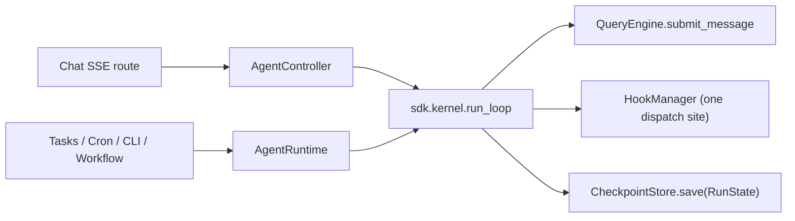

# LeAgent Agent 运行时 SDK

> 状态：生产可用。包：`backend/leagent/runtime/`。

英文版：[agent-runtime.md](./agent-runtime.md)

Agent 运行时是 LeAgent 中构建与执行 Agent 的统一、由 SDK 治理的运行框架。它用单一的声明式契约加一套执行门面，取代了此前在每个调用点（聊天 API、后台任务、Cron、CLI、工作流节点、子 Agent）手工构造 `QueryEngine` / `QueryEngineConfig` 的模式。

设计目标：**一次定义领域 Agent，随处运行** —— 以声明式真源（`AgentDefinition`）与代码优先的流式构建器（`AgentBuilder`）为双轨，二者均通过同一 `AgentRuntime` 解析并执行。

---

## 1. 三大契约

| 契约 | 文件 | 职责 |
|---|---|---|
| `AgentDefinition` | `runtime/definition.py` | **Agent 是什么**：人设/提示词变体、工具策略、模型策略、记忆策略、运行时预算、组合（hooks/subagents）。纯数据 —— 无依赖注入。 |
| `RuntimeContext` | `runtime/context.py` | **如何触达服务**：LLM、工具注册表、工具执行器、Agent 记忆、会话管理器、hooks、skills、提示词构建器、上下文设置。一个可注入的捆绑包。 |
| `AgentRuntime` | `runtime/runtime.py` | **执行门面**：解析定义，由定义 + 上下文 + 每次调用参数物化 `QueryEngineConfig`，驱动 `QueryEngine` 循环，并产出统一的 `AgentEvent` 流 / `AgentResult`。 |

```
AgentDefinition  +  RuntimeContext  +  per-call args
                         │
                         ▼
                  AgentRuntime._materialize_config()
                         │
                         ▼
                  QueryEngineConfig ──► QueryEngine ──► AgentEvent stream
```

### AgentDefinition

```python
from leagent.runtime import AgentDefinition, ToolPolicy, ModelPolicy, MemoryPolicy

AgentDefinition(
    name="support_agent",
    prompt_variant="default_agent",     # persona template
    context_recipe=None,                 # context-source recipe (defaults to prompt_variant)
    tools=ToolPolicy(allow=["web_search", "knowledge_*"], deny=[], max_tools=12),
    model=ModelPolicy(task="chat", temperature=0.1, max_output_tokens=8192),
    memory=MemoryPolicy(enabled=True, recall_limit=6, formation=True),
    runtime_profile="standard",
    max_turns=12,
    subagents=["script_agent"],
)
```

关键行为：

- `resolved_recipe()` 返回 `context_recipe or prompt_variant`，将**上下文组装配方**与**人设变体**解耦。
- `with_overrides(**fields)` 返回非原地修改的浅拷贝 —— 用于每轮、每次调用的覆盖。

### AgentBuilder（代码优先）

```python
from leagent.runtime import AgentBuilder

support = (
    AgentBuilder("support_agent")
    .describe("Customer support specialist")
    .variant("default_agent")
    .tools(allow=["web_search", "knowledge_*"], max_tools=12)
    .model(task="chat", temperature=0.3)
    .memory(recall_limit=8)
    .runtime(profile="standard", max_turns=12)
    .subagents("script_agent")
    .build()
)
```

`AgentBuilder.from_definition(existing)` 以现有定义初始化构建器，便于增量覆盖。`build()` 返回经校验、深拷贝的 `AgentDefinition`。

### AgentRegistry

`runtime/registry.py` 是查找入口。进程级注册表（`get_agent_registry()`）会惰性注册内置 Agent：

| Agent | 变体 | 说明 |
|---|---|---|
| `default_agent` | `default_agent` | 通用办公助手；记忆开启；可委派给 coding/script/subagent。 |
| `coding_agent` | `coding_agent` | 项目级工程子 Agent；`coding_long` 配置；formation 关闭。 |
| `script_agent` | `script_agent` | 沙箱化 Python 计算子 Agent；记忆关闭。 |
| `subagent` | `subagent` | 通用委派子 Agent；记忆关闭。 |

注册领域 Agent：

```python
runtime.registry.register(support)            # or get_agent_registry().register(support)
```

---

## 2. 执行

```python
from leagent.runtime import AgentRuntime

runtime = AgentRuntime.from_service_manager(service_manager)

# Aggregate result
result = await runtime.run("default_agent", "Summarise this PDF", session_id=sid)
print(result.text, result.success, result.tool_calls)

# Streaming
async for event in runtime.stream("coding_agent", "Refactor module X", cwd="/repo"):
    ...   # event.type / event.data — identical wire shape to SDKMessage
```

`AgentRuntime` 在需要指定 Agent 的任何位置都接受 `AgentRef`：注册表**名称**（`str`）、`AgentDefinition` 或 `AgentBuilder`。未知名称会回退到默认变体定义，因此运行时不会因名称缺失而硬失败。

### 物化

`_materialize_config()` 将声明式策略映射到 `QueryEngineConfig`：

- **Tools** —— 非空的 `tools.allow` 会构建作用域内的子 `ToolRegistry` 及匹配的 `ToolExecutor`；`tools.deny` 映射到 `tools_deny_patterns`；`tools.max_tools` 映射到 `tools_max_tools`。
- **Model** —— `model.task` 选择逻辑 `ModelTask` 绑定；`provider`/`model` 可覆盖；`temperature`/`max_output_tokens` 原样透传。
- **Memory** —— `memory.enabled=False` 会脱离 `AgentMemory`（无 recall）；formation 门控由 controller 在写入记忆时应用。
- **Context** —— `resolved_recipe()` 驱动 `ContextManager` 配方，与 `prompt_variant` 独立。
- **Budget** —— `runtime_profile` 解析 `RuntimeBudget`；显式的 `max_turns` / `max_tool_calls_per_turn` 可覆盖。

### 统一事件

`AgentEvent`（`runtime/events.py`）保留旧版 `SDKMessage` 的**完全相同的 `{type, data}` 线缆形态**，因此现有 SSE/WebSocket 序列化器无需改动：

```python
AgentEvent.from_sdk_message(msg)   # ingest
event.to_sdk_message()             # round-trip
event.is_terminal                  # type == "result"
```

`AgentResult` 是一次完整运行的聚合结果（`text`、`reason`、`error`、`usage`、`tool_calls`、`produced_files`，以及可选的 `events`）。

### 单一 think-act 路径（`sdk.kernel.run_loop`）

每条执行路径 —— **包括聊天 SSE 路由** —— 都经由同一内核循环 `leagent.sdk.kernel.loop.run_loop` 驱动。`AgentRuntime.stream` 与 `AgentController._run_via_query_engine` 均委托给它，而不是直接迭代 `QueryEngine.submit_message`。该循环：

- 将每条 `SDKMessage` 翻译为线缆形态一致的 `AgentEvent`（`{type, data}`），SSE/WebSocket 序列化器保持不变；
- 将 `engine.mutable_messages` 快照写入 `RunState.messages`，使检查点携带真实 transcript；
- 在**单点**派发工具 hook 生命周期（`TOOL_USE → dispatch_tool_call`、`TOOL_RESULT → dispatch_tool_result`、`RESULT → dispatch_complete`/`dispatch_error`）—— 调用点不再自行触发工具 hook，避免重复派发；
- 将 `**submit_kwargs`（例如 `append_user_turn`）转发给 engine。



---

## 3. 子 Agent 委派

`AgentRuntime.delegate(parent, agent, prompt, **overrides)` 是子 Agent 调用的统一入口。它解析子 `AgentDefinition` 的工具/模型/预算策略，再在 `parent`（`AgentController` 或 `QueryEngine`）之上驱动已验证的分叉核心（`leagent.agent.subagent._run_subagent_core`）。分叉机制 —— 子作用域 executor、abort 桥接、嵌套预览管线、文件状态合并 —— 均复用既有实现，因此委派是声明式的，无需重写久经考验的核心。

`CodingAgentTool`、`ScriptAgentTool` 与通用 `AgentTool` 均通过 `get_delegation_runtime().delegate()` 路由。`fork_subagent` 仍作为底层原语保留。

**定义保真。** 子 Agent 在*自身*策略下运行，而非父级策略：`delegate` 将解析后的 `context_recipe`、`model.task/provider/model`、`memory`（enabled / `recall_limit` / formation）以及子 `AgentDefinition` 的 `tools.max_tools` 传入 `_run_subagent_core` 并写入分叉后的 engine 配置。`memory.enabled=False` 的子 Agent 会脱离 `AgentMemory`，因此不会执行 recall。`subagent_start` / `subagent_stop` hook 在委派运行前后触发。

### 持久化会话与恢复

当内核因 `awaiting_user_input` 暂停一轮（并可选地在终止态 `completed` 时），会将 `RunState` 写入配置的 `CheckpointStore`，并在 `result` 事件上打上 `checkpoint_id`。这对应 Codex `RolloutRecorder` / Claude `SessionStore` 的类比。

- `CheckpointStore`（协议位于 `sdk/protocols.py`）在 `sdk/kernel/checkpoint.py` 中有两种内置实现：`InMemoryCheckpointStore`（默认/测试）与持久化 `SQLCheckpointStore`（表 `agent_checkpoints`，仓库 `db/repositories/agent_checkpoint.py`）。只要存在 `DatabaseService`，`RuntimeContext.from_service_manager` 就会注入 SQL store，因此恢复可跨进程重启与多 worker 工作。
- `AgentRuntime.resume(agent, checkpoint_id, prompt, **kw)` 加载检查点，用 `checkpoint.messages` 重新构建 engine（`build_engine(initial_messages=...)`），并以 `prompt` 驱动新一轮流式输出（例如用户对暂停的回复）。`AgentSession.resume(...)` 是便捷封装。
- 聊天侧 `awaiting_user_input` 的 result 会暴露 `checkpoint_id`，客户端可恢复持久化运行，而不必仅依赖旧版 `resumable_state` blob。

---

## 4. 工作流集成

Agent 通过 `agent_node_factory.py` 成为一等工作流节点，镜像 `tool_factory.py` 的 `Tool.<name>` 模式：

- 每个已注册的 `AgentDefinition` 在 bootstrap（`nodes/loader.bootstrap`）时提升为 `Agent.<name>` 节点（类别 `agents`）。
- 输入：`prompt`（以及可选的 `max_turns`、`allowed_tools`、`project_path`、`read_only`、`output`）。输出：`text`、`success`、`steps_count`。
- 运行时经工作流 DI 链注入：`WorkflowExecutor(agent_runtime=...)` → `HiddenHolder.agent_runtime`（`Hidden.AGENT_RUNTIME`）→ 节点 `execute`。
- 执行时，若 tool context 上存在父级 `agent_controller`，节点优先使用 `runtime.delegate(parent, …)`，否则通过 `runtime.run(...)` 独立运行。

旧版 `ScriptAgentNode` / `CodingAgentNode` 保留稳定节点 ID 与 schema，但现通过 `hidden.agent_runtime` 委派，而非单独定制 agent 构造。

`WorkflowExecutor` 实例在 `service_manager.py` 与工作流 worker 中通过 `AgentRuntime.from_service_manager(sm, executor=tool_executor)` 接线；子工作流经 `_ContextShim` 传播 runtime。

---

## 5. 调用点迁移（彻底切换）

| 调用点 | 路径 |
|---|---|
| Chat API | `chat_deps.build_agent_controller` → `AgentController`（薄 `AgentRuntime` 封装）。 |
| Background agent tasks | `tasks/handlers/agent_handler.AgentTaskHandler` → `AgentRuntime.build_engine(...)`。 |
| Cron | 经 `AgentTaskHandler`（`TaskType.AGENT`）路由。 |
| CLI | `cli/bootstrap.CLIServices.build_agent` → `AgentController`。 |
| Workflow nodes | `Agent.<name>` 节点 + `hidden.agent_runtime`。 |
| Sub-agents | `AgentRuntime.delegate`。 |

彻底切换中已移除：`agent/executor.py` 再导出 shim、`llm/router.py` shim，以及旧版仅注册表 `PromptBuilder` 回退（`PromptBuilder.build` 现要求 `ContextManager`，作为唯一规范组装路径；`RuntimeContext` 显式注入 builder）。

---

## 6. 可观测性

`AgentRuntime` 通过 `leagent.telemetry.otel` 发出 OpenTelemetry span：

- `agent.runtime.stream` —— 属性：`agent.name`、`agent.variant`、`agent.runtime_profile`、`agent.session_id`。
- `agent.runtime.delegate` —— 属性：`agent.name`、`agent.variant`、`agent.max_turns`、`agent.parent`。

它们嵌套在 `QueryEngine` 已有的 `agent.query_turn` span 之下。

---

## 7. 测试

| 领域 | 文件 |
|---|---|
| 定义 / 构建器 / 注册表 / 事件线缆一致性；委派保真 | `backend/tests/test_runtime_sdk.py` |
| 工作流 `Agent.<name>` 工厂（schema、注册、委派） | `backend/tests/workflow/test_agent_nodes.py` |
| 内核 `run_loop` 线缆形态 / messages / hooks；`SQLCheckpointStore` 往返；恢复 | `backend/tests/test_kernel_checkpoint.py` |
| 聊天 SSE 线缆契约回归（内核改道） | `backend/tests/test_chat_sse_wire_contract.py` |
| 插件发现（`leagent.llm_providers` / `leagent.context_sources`） | `backend/tests/test_plugin_discovery.py` |

```bash
cd backend
uv run pytest tests/test_runtime_sdk.py tests/workflow/test_agent_nodes.py \
  tests/test_kernel_checkpoint.py tests/test_chat_sse_wire_contract.py -v
```

---

## 8. 扩展：新增领域 Agent

```python
from leagent.runtime import AgentBuilder, get_agent_registry

triage = (
    AgentBuilder("triage_agent")
    .describe("Routes inbound requests to the right specialist")
    .variant("default_agent")
    .tools(allow=["web_search", "knowledge_*"], max_tools=10)
    .model(task="fast", temperature=0.0)
    .memory(enabled=True, formation=False)
    .runtime(profile="standard", max_turns=8)
    .subagents("coding_agent", "script_agent")
    .build()
)
get_agent_registry().register(triage)
```

下次工作流 bootstrap 时，`Agent.triage_agent` 节点会自动出现在面板中；聊天/runtime 路径可按名称调用，无需一次性接线。
